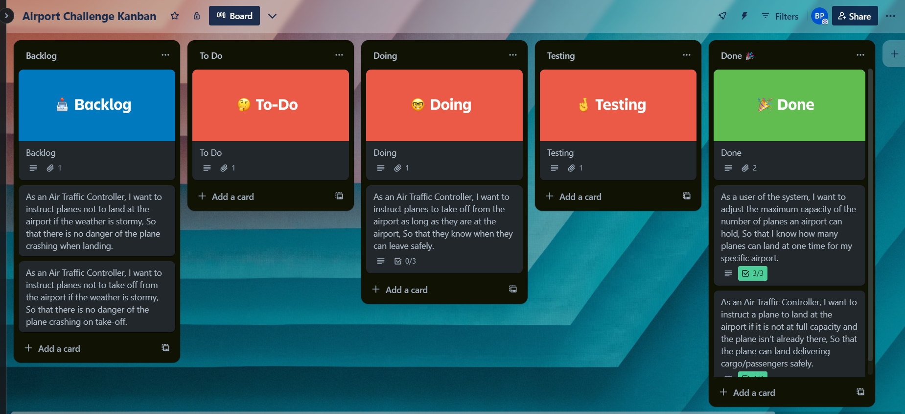

# Domain Models and Test Plan

### Task 1 - Benefits and Risks

The software is able to solve the problem of telling planes when to land at an airport. When there is no space for them to land due to the airport being at maximum capacity, they will be unable to land and will not be instructed to land at the airport. The software will also instruct a plane to take off depending on the condition that it is actually at the airport ath that time. When the weather conditions makes it unsafe for planes to land, the program will not instruct planes to land and take off.

The benefits this software will provide is that there will be an automatic response as to whether there is space at the airport for a plane to land, cutting out time delays of finding out whether it is already at max capacity.
Additionally, the software will be able to change its maximum capacity at the airport. This is intentional so if a new terminal is built away from the main area a different capacity can be set and the software can be reused.

Relevant risks related to the software are that although it will check to see that planes attempting to land are actually planes through their IDs, it wont check that they are expected planes as it doesn't have access to flight times, allowing potential for unwanted planes to be instructed to land.

### Task 2 + 3 - User Stories + Domain Models

As a user of the system,
I want to adjust the maximum capacity of the number of planes an airport can hold,
So that I know how many planes can land at one time for my specific airport.

| Object  | Properties          | Messages                 | Output |
| ------- | ------------------- | ------------------------ | ------ |
| Airport | maxCapacity@integer | setMaxCapacity(@integer) | @void  |

As an Air Traffic Controller,
I want to instruct a plane to land at the airport if it is not at full capacity and the plane isn't already there,
So that the plane can land delivering cargo/passengers safely.

| Object  | Properties              | Messages            | Output   |
| ------- | ----------------------- | ------------------- | -------- |
| Plane   | planeID@number          |                     |          |
| Airport | maxCapacity@integer     | checkCapacity()     | @boolean |
|         | planeList@array[@Plane] | landPlane(@boolean) | @void    |

As an Air Traffic Controller,
I want to instruct planes to take off from the airport as long as they are at the airport,
So that they know when they can leave safely.

| Object  | Properties              | Messages          | Output |
| ------- | ----------------------- | ----------------- | ------ |
| Plane   | planeID@number          |                   |        |
| Airport | planeList@array[@Plane] | takeOff(@boolean) | @void  |

### Additional Features User Stories

As an Air Traffic Controller,
I want to instruct planes not to land at the airport if the weather is stormy,
So that there is no danger of the plane crashing when landing.

| Object  | Properties              | Messages            | Output   |
| ------- | ----------------------- | ------------------- | -------- |
| Plane   | planeID@number          |                     |          |
| Airport | planeList@array[@Plane] | landPlane(@boolean) | @void    |
| Weather | Weathers@array          | checkIfStormy()     | @boolean |

As an Air Traffic Controller,
I want to instruct planes not to take off from the airport if the weather is stormy,
So that there is no danger of the plane crashing on take-off.

| Object  | Properties              | Messages          | Output   |
| ------- | ----------------------- | ----------------- | -------- |
| Plane   | planeID@number          |                   |          |
| Airport | planeList@array[@Plane] | takeOff(@boolean) | @void    |
| Weather | Weathers@array          | checkIfStormy()   | @boolean |

### Kanban Board Development

Initial Kanban Board

